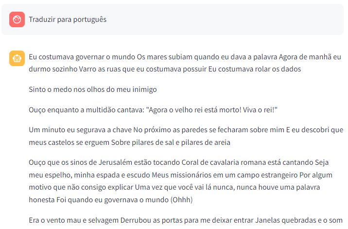
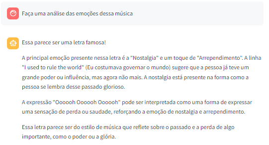
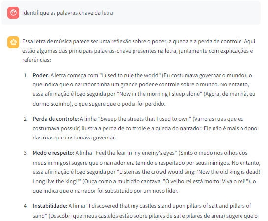
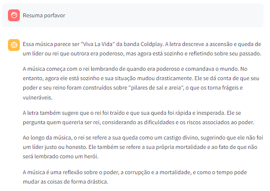
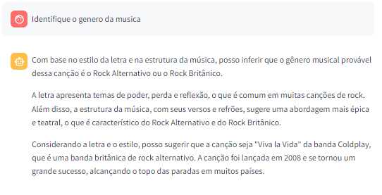

# Song Lyrics AI Toolkit 🎶

Alunos:
*   Gustavo Bauer Nogueira
*   Leonardo Severgnine Maioli
*   Thiago Alexandre Paiares e Silva

## _índice_

- <a href="#intro">Introdução</a>
- <a href="#tecnologias-utilizadas">Tecnologias utilizadas</a>
- <a href="#codigo">Código</a>
- <a href="#utilizacao">Utilização</a>
- <a href="#exemplo">Exemplo</a>

## _Introdução_

**Song Lyrics AI Toolkit** é um projeto desenvolvido por alunos da UFABC no decorrer da disciplina Processamento de Linguagem Natural (PLN), que oferece ferramentas baseadas em IA para análise, extração e geração de informações de letras de músicas. Este projeto permite ao usuário informar, em linguagem natural, uma música de um artista e pedir que o programa execute algumas tarefas, dentre as implementadas.

Utilizando técnicas de PLN e geração de imagens, o projeto **Song Lyrics AI Toolkit** permite realizar tarefas como:

- Buscar letras de músicas pelo nome da música e artista/banda.
- Traduzir a letra de uma música do idioma original para um idioma alvo.
- Identificar emoções existentes na letra da música.
- Identificar as palavras-chave da letra da música.
- Sintetizar a letra de uma música em um pequeno resumo.
- Identificar o gênero da música.
- Geração de arte para capa de álbum inspirada na letra da música.

Um exemplo da realização dessas tarefas é mostrado na seção exemplos.

Com foco na exploração criativa e analítica de letras de músicas, este toolkit possibilita novas formas de interação com composições musicais.

## _Tecnologias utilizadas_

A equipe utilizou a linguagem **Python** com o framework **LangChain** junto de modelos da **Groq** e **OpenAI** para o desenvolvimento do projeto. O modelo _*llama-3.1-70b-versatil*_ da Groq foi utilizado de forma gratuita para quase todas as ferramentas, com exceção para a ferramenta de geração de arte para capa de álbum inspirada na letra da música, na qual foi utilizado o modelo _*dall-e-3 da OpenaAI*_ com o custo aproximado de US$ 0,04 para cada imagem produzida.

Para obtenção das letras das músicas a partir do nome da música e artista/banda foi utilizada a API lyrics.ovh, cuja documentação pode ser acessada [aqui](https://lyricsovh.docs.apiary.io/#reference)!

Com o intuito de tornar a execução e exibição das tarefas de PLN implementadas mais agradável, a equipe utilizou a biblioteca gratuita e de código aberto em Python chamada **Streamlit**.

## _Código_

O código desenvolvido e as explicações detalhadas de cada etapa estão disponíveis no formato de um notebook Python [aqui](https://github.com/LeonardoMaioli/song_lyrics_ai_toolkit/blob/main/SongLyricsAIToolkit.ipynb)!

## _Utilização_

O código disponível no link da seção anterior, e consequentemente as tarefas disponíveis do toolkit, pode ser executado de duas maneiras. A primeira é de forma sequencial, executando módulo a módulo do notebook. Já a segunda maneira é utilizando o StreamLit, tornando a interação similar a uma conversa com um chatbot.

- **Executando de forma sequencial:**
Para a execução sequencial, basta seguir o passo a passo os módulos do notebook. Em determinado momento, o usuário deverá informar, em linguagem natural, qual o título e o artista da música que ele deseja utilizar para realizar as tarefas. Dessa forma, a letra da música será obtida. Seguindo o passo a passo, o usuário deve descrever qual a tarefa ele deseja executar sobre a letra da música. A tarefa pedida será identificada e executada, gerando o resultado pedido. Essa forma de execução acaba permitindo uma única tarefa por vez. Para realizar outra tarefa, o usuário deve voltar ao módulo do notebook em que ele descreve a tarefa que deseja executar. O código também mostra uma opção onde o usuário pode passar uma lista de prompts e consequentemente obter diferentes resultados em uma única vez.

- **Executando com o StreamLit**:
Para a execução utilizando a ferramenta do Streamlit, o usuário precisa apenas executar os módulos após o tópico com nome _*Aplicação Streamlit*_, além de configurar as suas chaves dos modelos utilizados. Feito isso, o usuário pode acessar o link gerado e terá as intruções na tela para realizar as tarefas de forma mais interativa com um chatbot.

## _Exemplo_

Para demonstrar um exemplo de resultado, seguem as saídas obtidas para a música **Viva La Vida** da banda **Coldplay** para cada uma das ferramentas. Note que algumas das saídas foram cortadas devido ao tamanho. Não perca tempo, teste você mesmo!

- **Tradução**:
  
  
  
- **Identificação das emoções:**
  
  
  
- **Identificação das palavras-chave:**
  
  
  
- **Resumo:**
  
  
  
- **Identificação do gênero:**
  
  
  
- **Arte para capa de álbum:**
  
  

Para visualizar mais exemplos de arte para capa de álbum geradas, você pode clicar [aqui](https://github.com/LeonardoMaioli/song_lyrics_ai_toolkit/tree/main/album_cover).

